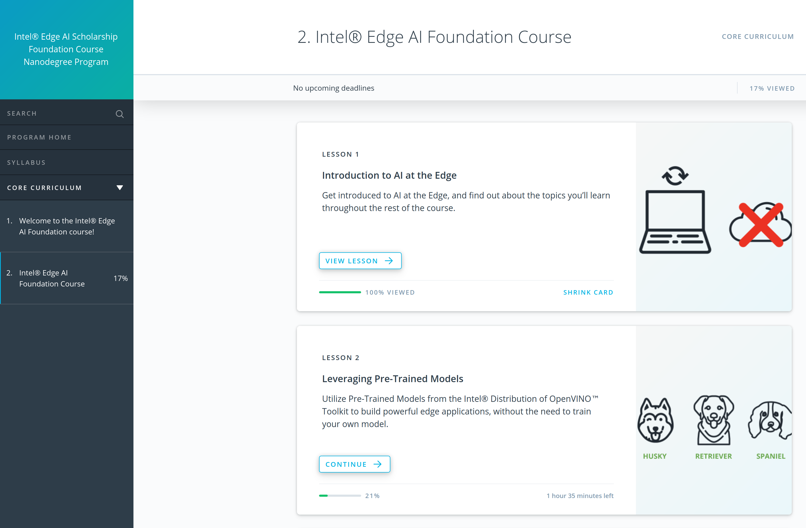
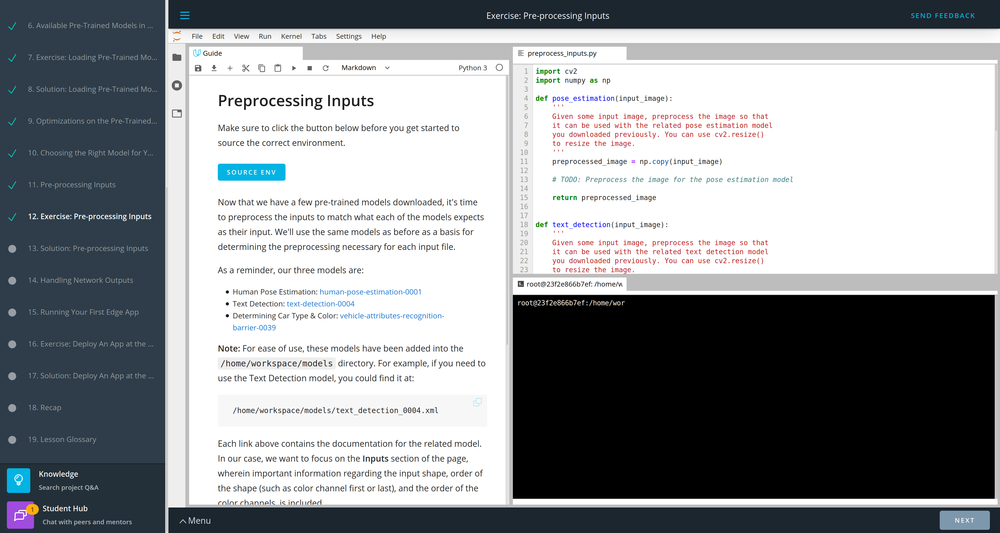
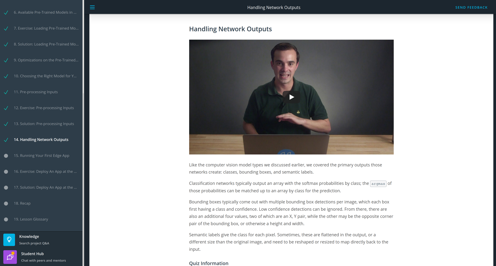
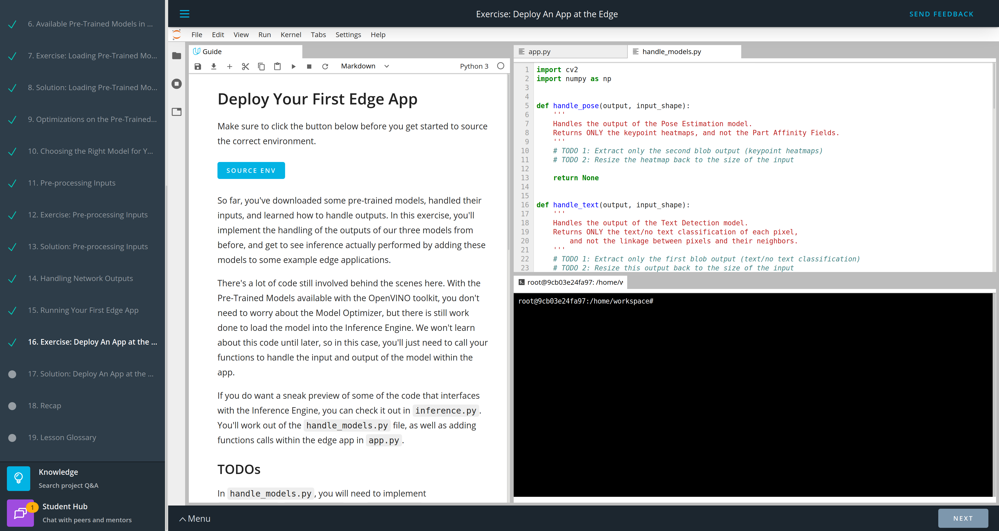
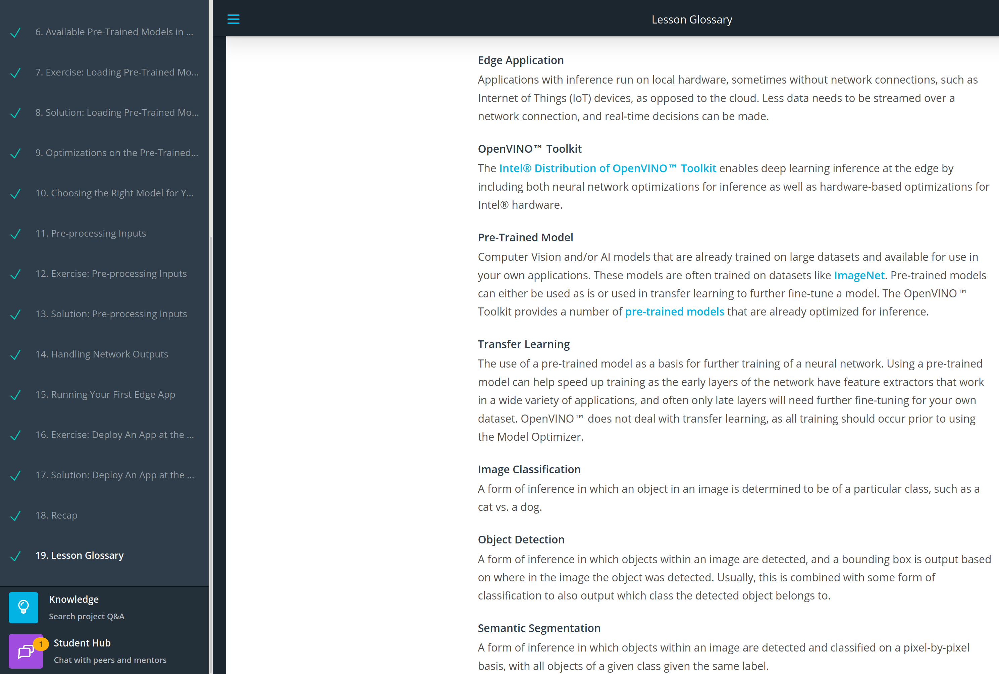
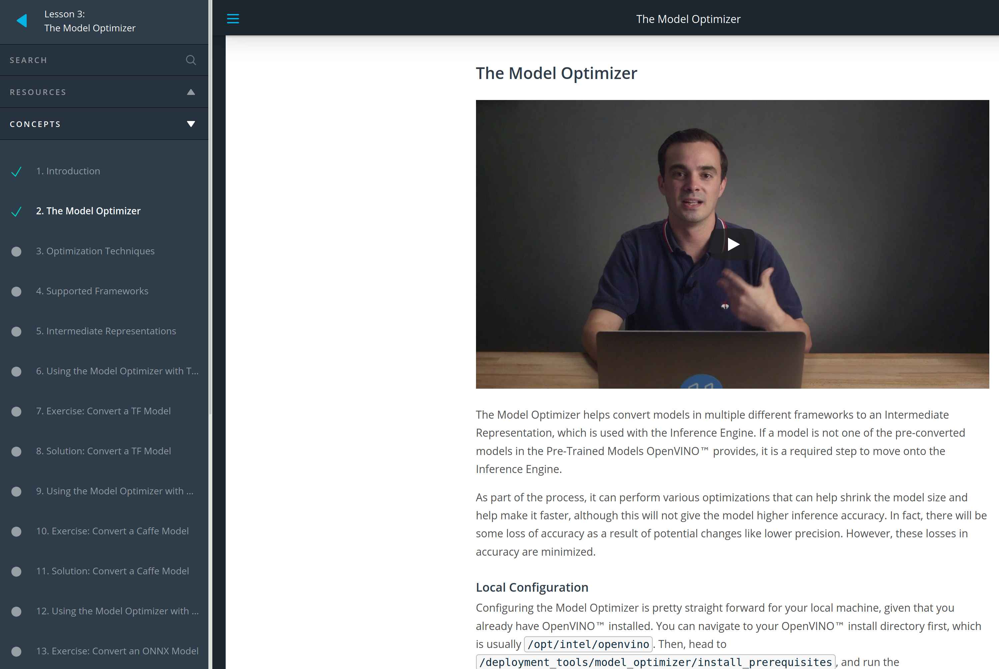

# 2.5-month-of-intel-edge-ai
My pledge "2.5 months of Udacity" for the Intel Edge AI Scholarship Program:\
https://www.udacity.com/scholarships/intel-edge-ai-scholarship

## Day 1: December 16, 2019. #30DaysofUdacity #FinalDaysof2019
- I entered the classroom and watched some videos.
- My current progress is:\
  **Part 2. Intel® Edge AI Foundation Course** (Progress 17%)\
  **Lesson 2 - Leveraging Pre-Trained Models** (Progress 21%)\
  **4. Types of Computer Vision Models**
- I registered to the Slack workspace of the Intel Edge AI Challenge: https://inteledgeaichallenge.slack.com
- I encourage @KhushkumarP, @Jacqueline SusanM, @labibaR, @OudarjyaS, @MuhammadN, @Mohamed ChoukriB, @KonstantinosK, @AdityaK, @MahmmoudM, @LauraT, @ElenaK, @HelenaB, @RobO, @ShafaqA, @Nancy A, @TzuhsinC, @TemitopeO, @AarthiA, @NabhanA, @MD BAPPIP, @AnkitV, @fuzhanR, @Laszlo TothL. 

## Day 2: December 17, 2019. #30DaysofUdacity #FinalDaysof2019
- I watched some video lectures.
- My current progress is:\
  **Part 2. Intel® Edge AI Foundation Course** (Progress 20%)\
  **Lesson 2 - Leveraging Pre-Trained Models** (Progress 37%)\
  **7. Exercise: Loading Pre-Trained Models**
- I navigated through the Slack workspace of the Intel Edge AI Challenge.
- I encourage @KhushkumarP, @Jacqueline SusanM, @labibaR, @OudarjyaS, @MuhammadN, @Mohamed ChoukriB, @KonstantinosK, @AdityaK, @MahmmoudM, @LauraT, @ElenaK, @HelenaB, @RobO, @ShafaqA, @Nancy A, @TzuhsinC, @TemitopeO, @AarthiA, @NabhanA, @MD BAPPIP, @AnkitV, @fuzhanR, @Laszlo TothL. 

## Day 3: December 18, 2019. #30DaysofUdacity #FinalDaysof2019
- I watched some video lectures.
- My current progress is:\
  **Part 2. Intel® Edge AI Foundation Course** (Progress 26%)\
  **Lesson 2 - Leveraging Pre-Trained Models** (Progress 63%)\
  **12. Exercise: Pre-processing Inputs**
- I navigated through the Slack workspace of the Intel Edge AI Challenge.
- I encourage @KhushkumarP, @Jacqueline SusanM, @labibaR, @OudarjyaS, @MuhammadN, @Mohamed ChoukriB, @KonstantinosK, @AdityaK, @MahmmoudM, @LauraT, @ElenaK, @HelenaB, @RobO, @ShafaqA, @Nancy A, @TzuhsinC, @TemitopeO, @AarthiA, @NabhanA, @MD BAPPIP, @AnkitV, @fuzhanR, @Laszlo TothL. 

## Day 4: December 19, 2019. #30DaysofUdacity #FinalDaysof2019
- I watched some video lectures.
- My current progress is:\
  **Part 2. Intel® Edge AI Foundation Course** (Progress 28%)\
  **Lesson 2 - Leveraging Pre-Trained Models** (Progress 74%)\
  **14. Handling Network Outputs**
- I navigated through the Slack workspace of the Intel Edge AI Challenge.
- I encourage @KhushkumarP, @Jacqueline SusanM, @labibaR, @OudarjyaS, @MuhammadN, @Mohamed ChoukriB, @KonstantinosK, @AdityaK, @MahmmoudM, @LauraT, @ElenaK, @HelenaB, @RobO, @ShafaqA, @Nancy A, @TzuhsinC, @TemitopeO, @AarthiA, @NabhanA, @MD BAPPIP, @AnkitV, @fuzhanR, @Laszlo TothL. 

## Day 5: December 20, 2019. #30DaysofUdacity #FinalDaysof2019
- I watched some video lectures.
- My current progress is:\
  **Part 2. Intel® Edge AI Foundation Course** (Progress 31%)\
  **Lesson 2 - Leveraging Pre-Trained Models** (Progress 84%)\
  **16. Exercise: Deploy An App at the Edge**
- I navigated through the Slack workspace of the Intel Edge AI Challenge.
- I encourage @KhushkumarP, @Jacqueline SusanM, @labibaR, @OudarjyaS, @MuhammadN, @Mohamed ChoukriB, @KonstantinosK, @AdityaK, @MahmmoudM, @LauraT, @ElenaK, @HelenaB, @RobO, @ShafaqA, @Nancy A, @TzuhsinC, @TemitopeO, @AarthiA, @NabhanA, @MD BAPPIP, @AnkitV, @fuzhanR, @Laszlo TothL. 

## Day 6: December 21, 2019. #30DaysofUdacity #FinalDaysof2019
- I watched some video lectures.
- My current progress is:\
  **Part 2. Intel® Edge AI Foundation Course** (Progress 34%)\
  **Lesson 2 - Leveraging Pre-Trained Models** (Progress 100%)\
  **19. Lesson Glossary**
- I navigated through the Slack workspace of the Intel Edge AI Challenge.
- I encourage @KhushkumarP, @Jacqueline SusanM, @labibaR, @OudarjyaS, @MuhammadN, @Mohamed ChoukriB, @KonstantinosK, @AdityaK, @MahmmoudM, @LauraT, @ElenaK, @HelenaB, @RobO, @ShafaqA, @Nancy A, @TzuhsinC, @TemitopeO, @AarthiA, @NabhanA, @MD BAPPIP, @AnkitV, @fuzhanR, @Laszlo TothL. 

## Day 7: December 22, 2019. #30DaysofUdacity #FinalDaysof2019
- I watched some video lectures.
- My current progress is:\
  **Part 2. Intel® Edge AI Foundation Course** (Progress 37%)\
  **Lesson 3 - The Model Optimizer** (Progress 10%)\
  **2. The Model Optimizer**
- I navigated through the Slack workspace of the Intel Edge AI Challenge.
- I encourage @KhushkumarP, @Jacqueline SusanM, @labibaR, @OudarjyaS, @MuhammadN, @Mohamed ChoukriB, @KonstantinosK, @AdityaK, @MahmmoudM, @LauraT, @ElenaK, @HelenaB, @RobO, @ShafaqA, @Nancy A, @TzuhsinC, @TemitopeO, @AarthiA, @NabhanA, @MD BAPPIP, @AnkitV, @fuzhanR, @Laszlo TothL. 

