# 2.5-month-of-intel-edge-ai
My pledge "2.5 months of Udacity" for the Intel Edge AI Scholarship Program:\
https://www.udacity.com/scholarships/intel-edge-ai-scholarship

## Day 1: December 16, 2019. #30DaysofUdacity #FinalDaysof2019
- I entered the classroom and watched some videos.
- My current progress is:\
  **Part 2. Intel® Edge AI Foundation Course** (Progress 17%)\
  **Lesson 2 - Leveraging Pre-Trained Models** (Progress 21%)\
  **4. Types of Computer Vision Models**
- I registered to the Slack workspace of the Intel Edge AI Challenge: https://inteledgeaichallenge.slack.com
- I encourage @KhushkumarP, @Jacqueline SusanM, @labibaR, @OudarjyaS, @MuhammadN, @Mohamed ChoukriB, @KonstantinosK, @AdityaK, @MahmmoudM, @LauraT, @ElenaK, @HelenaB, @RobO, @ShafaqA, @Nancy A, @TzuhsinC, @TemitopeO, @AarthiA, @NabhanA, @MD BAPPIP, @AnkitV, @fuzhanR, @Laszlo TothL. 

## Day 2: December 17, 2019. #30DaysofUdacity #FinalDaysof2019
- I watched some video lectures.
- My current progress is:\
  **Part 2. Intel® Edge AI Foundation Course** (Progress 20%)\
  **Lesson 2 - Leveraging Pre-Trained Models** (Progress 37%)\
  **7. Exercise: Loading Pre-Trained Models**
- I navigated through the Slack workspace of the Intel Edge AI Challenge.
- I encourage @KhushkumarP, @Jacqueline SusanM, @labibaR, @OudarjyaS, @MuhammadN, @Mohamed ChoukriB, @KonstantinosK, @AdityaK, @MahmmoudM, @LauraT, @ElenaK, @HelenaB, @RobO, @ShafaqA, @Nancy A, @TzuhsinC, @TemitopeO, @AarthiA, @NabhanA, @MD BAPPIP, @AnkitV, @fuzhanR, @Laszlo TothL. 

## Day 3: December 18, 2019. #30DaysofUdacity #FinalDaysof2019
- I watched some video lectures.
- My current progress is:\
  **Part 2. Intel® Edge AI Foundation Course** (Progress 26%)\
  **Lesson 2 - Leveraging Pre-Trained Models** (Progress 63%)\
  **12. Exercise: Pre-processing Inputs**
- I navigated through the Slack workspace of the Intel Edge AI Challenge.
- I encourage @KhushkumarP, @Jacqueline SusanM, @labibaR, @OudarjyaS, @MuhammadN, @Mohamed ChoukriB, @KonstantinosK, @AdityaK, @MahmmoudM, @LauraT, @ElenaK, @HelenaB, @RobO, @ShafaqA, @Nancy A, @TzuhsinC, @TemitopeO, @AarthiA, @NabhanA, @MD BAPPIP, @AnkitV, @fuzhanR, @Laszlo TothL. 

## Day 4: December 19, 2019. #30DaysofUdacity #FinalDaysof2019
- I watched some video lectures.
- My current progress is:\
  **Part 2. Intel® Edge AI Foundation Course** (Progress 28%)\
  **Lesson 2 - Leveraging Pre-Trained Models** (Progress 74%)\
  **14. Handling Network Outputs**
- I navigated through the Slack workspace of the Intel Edge AI Challenge.
- I encourage @KhushkumarP, @Jacqueline SusanM, @labibaR, @OudarjyaS, @MuhammadN, @Mohamed ChoukriB, @KonstantinosK, @AdityaK, @MahmmoudM, @LauraT, @ElenaK, @HelenaB, @RobO, @ShafaqA, @Nancy A, @TzuhsinC, @TemitopeO, @AarthiA, @NabhanA, @MD BAPPIP, @AnkitV, @fuzhanR, @Laszlo TothL. 

## Day 5: December 20, 2019. #30DaysofUdacity #FinalDaysof2019
- I watched some video lectures.
- My current progress is:\
  **Part 2. Intel® Edge AI Foundation Course** (Progress 31%)\
  **Lesson 2 - Leveraging Pre-Trained Models** (Progress 84%)\
  **16. Exercise: Deploy An App at the Edge**
- I navigated through the Slack workspace of the Intel Edge AI Challenge.
- I encourage @KhushkumarP, @Jacqueline SusanM, @labibaR, @OudarjyaS, @MuhammadN, @Mohamed ChoukriB, @KonstantinosK, @AdityaK, @MahmmoudM, @LauraT, @ElenaK, @HelenaB, @RobO, @ShafaqA, @Nancy A, @TzuhsinC, @TemitopeO, @AarthiA, @NabhanA, @MD BAPPIP, @AnkitV, @fuzhanR, @Laszlo TothL. 

## Day 6: December 21, 2019. #30DaysofUdacity #FinalDaysof2019
- I watched some video lectures.
- My current progress is:\
  **Part 2. Intel® Edge AI Foundation Course** (Progress 34%)\
  **Lesson 2 - Leveraging Pre-Trained Models** (Progress 100%)\
  **19. Lesson Glossary**
- I navigated through the Slack workspace of the Intel Edge AI Challenge.
- I encourage @KhushkumarP, @Jacqueline SusanM, @labibaR, @OudarjyaS, @MuhammadN, @Mohamed ChoukriB, @KonstantinosK, @AdityaK, @MahmmoudM, @LauraT, @ElenaK, @HelenaB, @RobO, @ShafaqA, @Nancy A, @TzuhsinC, @TemitopeO, @AarthiA, @NabhanA, @MD BAPPIP, @AnkitV, @fuzhanR, @Laszlo TothL. 

## Day 7: December 22, 2019. #30DaysofUdacity #FinalDaysof2019
- I watched some video lectures.
- My current progress is:\
  **Part 2. Intel® Edge AI Foundation Course** (Progress 37%)\
  **Lesson 3 - The Model Optimizer** (Progress 10%)\
  **2. The Model Optimizer**
- I navigated through the Slack workspace of the Intel Edge AI Challenge.
- I encourage @KhushkumarP, @Jacqueline SusanM, @labibaR, @OudarjyaS, @MuhammadN, @Mohamed ChoukriB, @KonstantinosK, @AdityaK, @MahmmoudM, @LauraT, @ElenaK, @HelenaB, @RobO, @ShafaqA, @Nancy A, @TzuhsinC, @TemitopeO, @AarthiA, @NabhanA, @MD BAPPIP, @AnkitV, @fuzhanR, @Laszlo TothL. 

## Day 8: December 23, 2019. #30DaysofUdacity #FinalDaysof2019
- I watched some video lectures.
- My current progress is:\
  **Part 2. Intel® Edge AI Foundation Course** (Progress 39%)\
  **Lesson 3 - The Model Optimizer** (Progress 20%)\
  **4. Supported Frameworks**
- I navigated through the Slack workspace of the Intel Edge AI Challenge.
- I encourage @KhushkumarP, @Jacqueline SusanM, @labibaR, @OudarjyaS, @MuhammadN, @Mohamed ChoukriB, @KonstantinosK, @AdityaK, @MahmmoudM, @LauraT, @ElenaK, @HelenaB, @RobO, @ShafaqA, @Nancy A, @TzuhsinC, @TemitopeO, @AarthiA, @NabhanA, @MD BAPPIP, @AnkitV, @fuzhanR, @Laszlo TothL. 

## Day 9: December 24, 2019. #30DaysofUdacity #FinalDaysof2019
- I watched some video lectures.
- My current progress is:\
  **Part 2. Intel® Edge AI Foundation Course** (Progress 41%)\
  **Lesson 3 - The Model Optimizer** (Progress 30%)\
  **6. Using the Model Optimizer with TensorFlow Models**
- I navigated through the Slack workspace of the Intel Edge AI Challenge.
- I encourage @KhushkumarP, @Jacqueline SusanM, @labibaR, @OudarjyaS, @MuhammadN, @Mohamed ChoukriB, @KonstantinosK, @AdityaK, @MahmmoudM, @LauraT, @ElenaK, @HelenaB, @RobO, @ShafaqA, @Nancy A, @TzuhsinC, @TemitopeO, @AarthiA, @NabhanA, @MD BAPPIP, @AnkitV, @fuzhanR, @Laszlo TothL. 

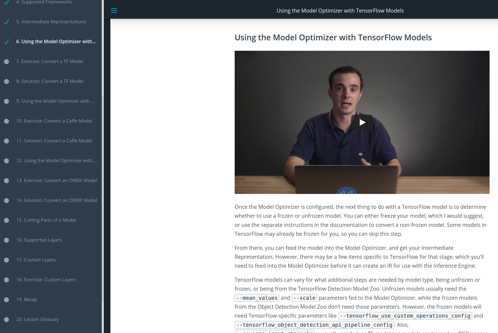

## Day 10: December 25, 2019. #30DaysofUdacity #FinalDaysof2019
- I watched some video lectures.
- My current progress is:\
  **Part 2. Intel® Edge AI Foundation Course** (Progress 42%)\
  **Lesson 3 - The Model Optimizer** (Progress 35%)\
  **7. Exercise: Convert a TF Model**
- I navigated through the Slack workspace of the Intel Edge AI Challenge.
- I encourage @KhushkumarP, @Jacqueline SusanM, @labibaR, @OudarjyaS, @MuhammadN, @Mohamed ChoukriB, @KonstantinosK, @AdityaK, @MahmmoudM, @LauraT, @ElenaK, @HelenaB, @RobO, @ShafaqA, @Nancy A, @TzuhsinC, @TemitopeO, @AarthiA, @NabhanA, @MD BAPPIP, @AnkitV, @fuzhanR, @Laszlo TothL. 

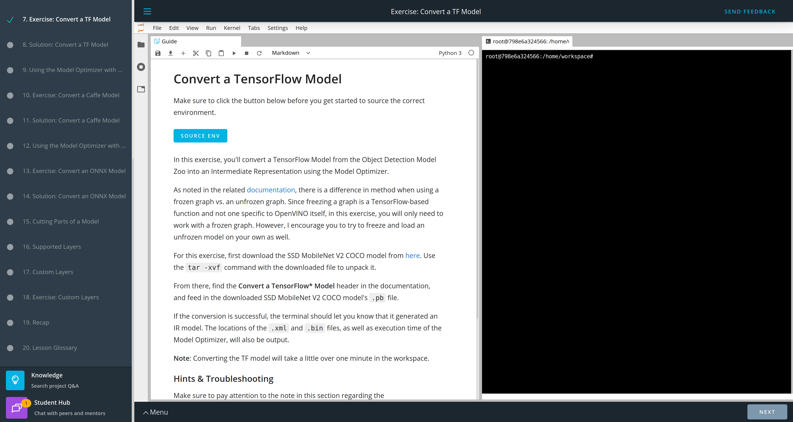

## Day 11: December 26, 2019. #30DaysofUdacity #FinalDaysof2019
- I watched some video lectures.
- My current progress is:\
  **Part 2. Intel® Edge AI Foundation Course** (Progress 44%)\
  **Lesson 3 - The Model Optimizer** (Progress 40%)\
  **8. Solution: Convert a TF Model**
- I navigated through the Slack workspace of the Intel Edge AI Challenge.
- I encourage @KhushkumarP, @Jacqueline SusanM, @labibaR, @OudarjyaS, @MuhammadN, @Mohamed ChoukriB, @KonstantinosK, @AdityaK, @MahmmoudM, @LauraT, @ElenaK, @HelenaB, @RobO, @ShafaqA, @Nancy A, @TzuhsinC, @TemitopeO, @AarthiA, @NabhanA, @MD BAPPIP, @AnkitV, @fuzhanR, @Laszlo TothL. 

## Day 12: December 27, 2019. #30DaysofUdacity #FinalDaysof2019
- I watched some video lectures.
- My current progress is:\
  **Part 2. Intel® Edge AI Foundation Course** (Progress 46%)\
  **Lesson 3 - The Model Optimizer** (Progress 50%)\
  **10. Exercise: Convert a Caffe Model**
- I navigated through the Slack workspace of the Intel Edge AI Challenge.
- I encourage @KhushkumarP, @Jacqueline SusanM, @labibaR, @OudarjyaS, @MuhammadN, @Mohamed ChoukriB, @KonstantinosK, @AdityaK, @MahmmoudM, @LauraT, @ElenaK, @HelenaB, @RobO, @ShafaqA, @Nancy A, @TzuhsinC, @TemitopeO, @AarthiA, @NabhanA, @MD BAPPIP, @AnkitV, @fuzhanR, @Laszlo TothL. 

## Day 13: December 28, 2019. #30DaysofUdacity #FinalDaysof2019
- I watched some video lectures.
- My current progress is:\
  **Part 2. Intel® Edge AI Foundation Course** (Progress 47%)\
  **Lesson 3 - The Model Optimizer** (Progress 55%)\
  **11. Solution: Convert a Caffe Model**
- I navigated through the Slack workspace of the Intel Edge AI Challenge.
- I encourage @KhushkumarP, @Jacqueline SusanM, @labibaR, @OudarjyaS, @MuhammadN, @Mohamed ChoukriB, @KonstantinosK, @AdityaK, @MahmmoudM, @LauraT, @ElenaK, @HelenaB, @RobO, @ShafaqA, @Nancy A, @TzuhsinC, @TemitopeO, @AarthiA, @NabhanA, @MD BAPPIP, @AnkitV, @fuzhanR, @Laszlo TothL. 

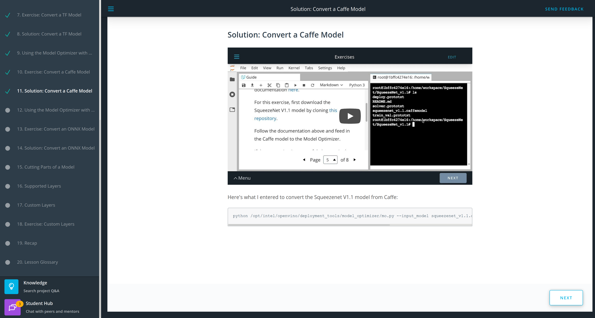

## Day 14: December 29, 2019. #30DaysofUdacity #FinalDaysof2019
- I watched some video lectures.
- My current progress is:\
  **Part 2. Intel® Edge AI Foundation Course** (Progress 48%)\
  **Lesson 3 - The Model Optimizer** (Progress 60%)\
  **12. Using the Model Optimizer with ONNX Models**
- I navigated through the Slack workspace of the Intel Edge AI Challenge.
- I encourage @KhushkumarP, @Jacqueline SusanM, @labibaR, @OudarjyaS, @MuhammadN, @Mohamed ChoukriB, @KonstantinosK, @AdityaK, @MahmmoudM, @LauraT, @ElenaK, @HelenaB, @RobO, @ShafaqA, @Nancy A, @TzuhsinC, @TemitopeO, @AarthiA, @NabhanA, @MD BAPPIP, @AnkitV, @fuzhanR, @Laszlo TothL. 

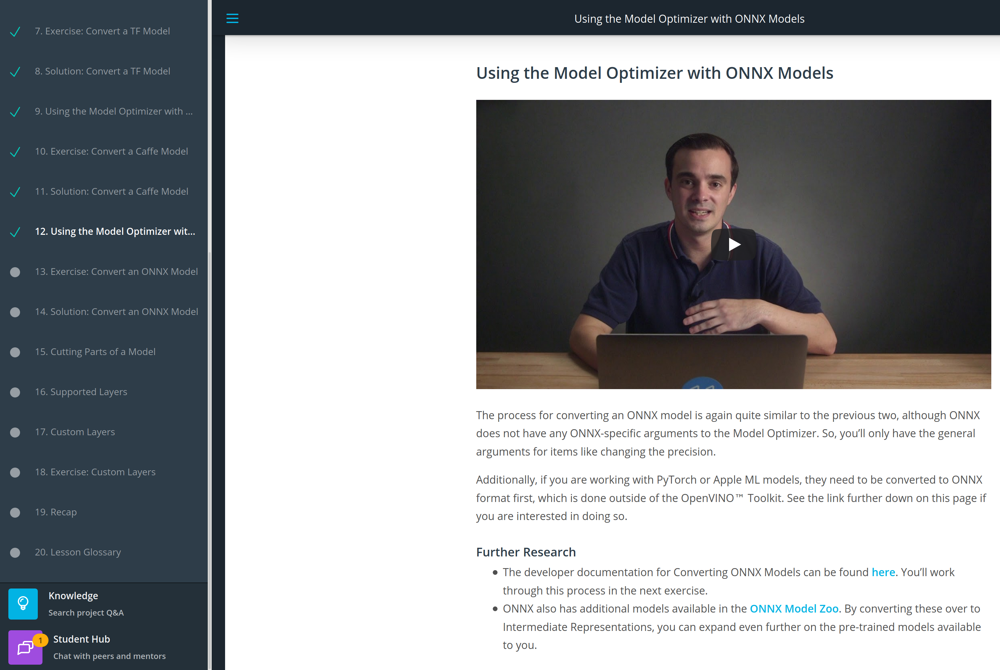

## Day 15: December 30, 2019. #30DaysofUdacity #FinalDaysof2019
- I watched some video lectures.
- My current progress is:\
  **Part 2. Intel® Edge AI Foundation Course** (Progress 49%)\
  **Lesson 3 - The Model Optimizer** (Progress 65%)\
  **13. Exercise: Convert an ONNX Model**
- I navigated through the Slack workspace of the Intel Edge AI Challenge.
- I encourage @KhushkumarP, @Jacqueline SusanM, @labibaR, @OudarjyaS, @MuhammadN, @Mohamed ChoukriB, @KonstantinosK, @AdityaK, @MahmmoudM, @LauraT, @ElenaK, @HelenaB, @RobO, @ShafaqA, @Nancy A, @TzuhsinC, @TemitopeO, @AarthiA, @NabhanA, @MD BAPPIP, @AnkitV, @fuzhanR, @Laszlo TothL. 

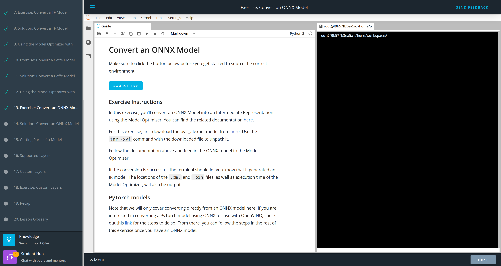

## Day 16: December 31, 2019. #30DaysofUdacity #FinalDaysof2019
- I watched some video lectures.
- My current progress is:\
  **Part 2. Intel® Edge AI Foundation Course** (Progress 50%)\
  **Lesson 3 - The Model Optimizer** (Progress 70%)\
  **14. Solution: Convert an ONNX Model**
- I navigated through the Slack workspace of the Intel Edge AI Challenge.
- I encourage @KhushkumarP, @Jacqueline SusanM, @labibaR, @OudarjyaS, @MuhammadN, @Mohamed ChoukriB, @KonstantinosK, @AdityaK, @MahmmoudM, @LauraT, @ElenaK, @HelenaB, @RobO, @ShafaqA, @Nancy A, @TzuhsinC, @TemitopeO, @AarthiA, @NabhanA, @MD BAPPIP, @AnkitV, @fuzhanR, @Laszlo TothL. 

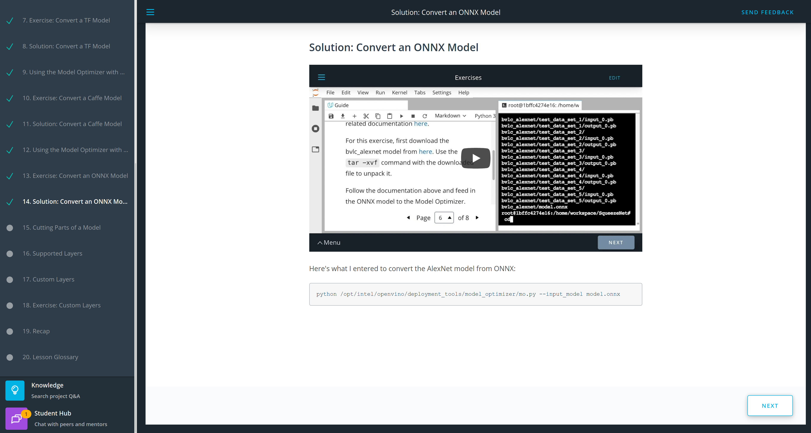

## Day 17: January 1, 2020. #30DaysofUdacity #FinalDaysof2019
- I watched some video lectures.
- My current progress is:\
  **Part 2. Intel® Edge AI Foundation Course** (Progress 52%)\
  **Lesson 3 - The Model Optimizer** (Progress 75%)\
  **15. Cutting Parts of a Model**
- I navigated through the Slack workspace of the Intel Edge AI Challenge.
- I encourage @KhushkumarP, @Jacqueline SusanM, @labibaR, @OudarjyaS, @MuhammadN, @Mohamed ChoukriB, @KonstantinosK, @AdityaK, @MahmmoudM, @LauraT, @ElenaK, @HelenaB, @RobO, @ShafaqA, @Nancy A, @TzuhsinC, @TemitopeO, @AarthiA, @NabhanA, @MD BAPPIP, @AnkitV, @fuzhanR, @Laszlo TothL. 

## Day 18: January 2, 2020. #30DaysofUdacity #FinalDaysof2019
- I watched some video lectures.
- My current progress is:\
  **Part 2. Intel® Edge AI Foundation Course** (Progress 53%)\
  **Lesson 3 - The Model Optimizer** (Progress 80%)\
  **16. Supported Layers**
- I navigated through the Slack workspace of the Intel Edge AI Challenge.
- I encourage @KhushkumarP, @Jacqueline SusanM, @labibaR, @OudarjyaS, @MuhammadN, @Mohamed ChoukriB, @KonstantinosK, @AdityaK, @MahmmoudM, @LauraT, @ElenaK, @HelenaB, @RobO, @ShafaqA, @Nancy A, @TzuhsinC, @TemitopeO, @AarthiA, @NabhanA, @MD BAPPIP, @AnkitV, @fuzhanR, @Laszlo TothL. 

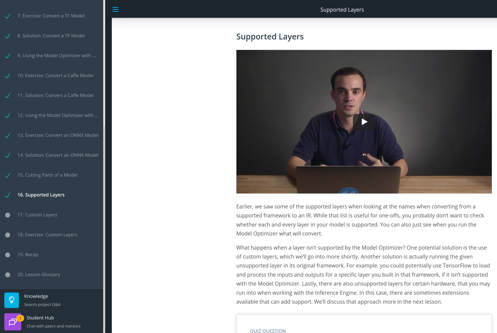

## Day 19: January 3, 2020. #30DaysofUdacity #FinalDaysof2019
- I watched some video lectures.
- My current progress is:\
  **Part 2. Intel® Edge AI Foundation Course** (Progress 53%)\
  **Lesson 3 - The Model Optimizer** (Progress 80%)\
  **17. Custom Layers**
- I navigated through the Slack workspace of the Intel Edge AI Challenge.
- I encourage @KhushkumarP, @Jacqueline SusanM, @labibaR, @OudarjyaS, @MuhammadN, @Mohamed ChoukriB, @KonstantinosK, @AdityaK, @MahmmoudM, @LauraT, @ElenaK, @HelenaB, @RobO, @ShafaqA, @Nancy A, @TzuhsinC, @TemitopeO, @AarthiA, @NabhanA, @MD BAPPIP, @AnkitV, @fuzhanR, @Laszlo TothL. 

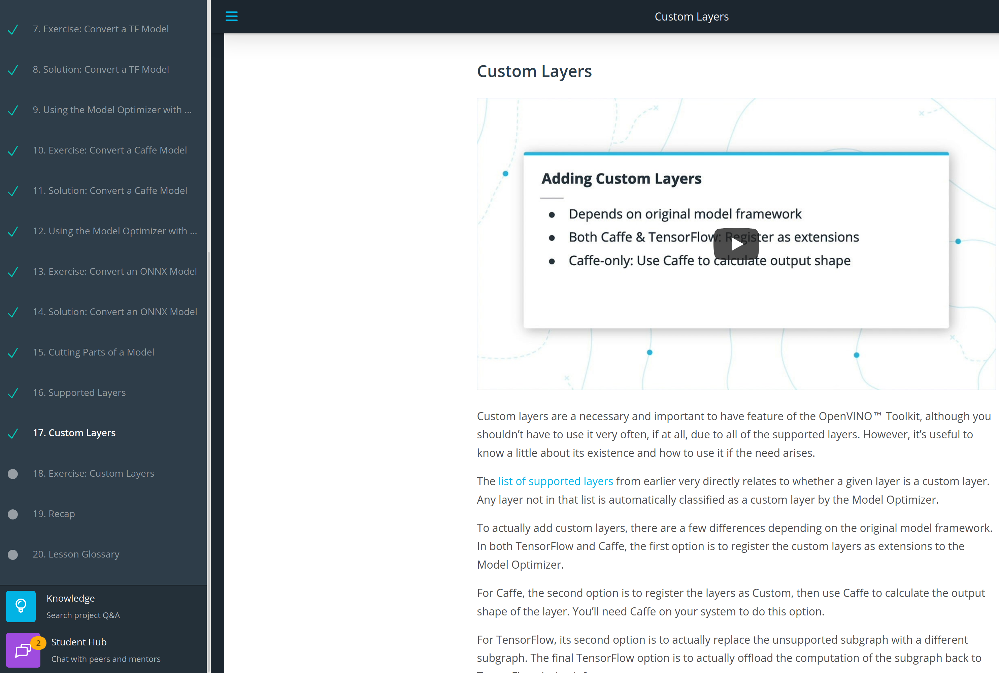

## Day 20: January 4, 2020. #30DaysofUdacity #FinalDaysof2019
- I watched some video lectures.
- My current progress is:\
  **Part 2. Intel® Edge AI Foundation Course** (Progress 55%)\
  **Lesson 3 - The Model Optimizer** (Progress 90%)\
  **18. Exercise: Custom Layers**
- I navigated through the Slack workspace of the Intel Edge AI Challenge.
- I encourage @KhushkumarP, @Jacqueline SusanM, @labibaR, @OudarjyaS, @MuhammadN, @Mohamed ChoukriB, @KonstantinosK, @AdityaK, @MahmmoudM, @LauraT, @ElenaK, @HelenaB, @RobO, @ShafaqA, @Nancy A, @TzuhsinC, @TemitopeO, @AarthiA, @NabhanA, @MD BAPPIP, @AnkitV, @fuzhanR, @Laszlo TothL. 

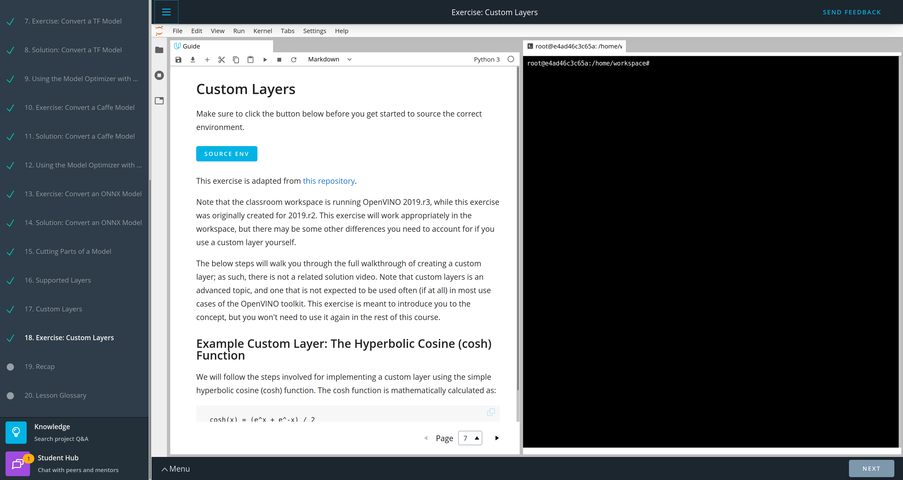

## Day 21: January 5, 2020. #30DaysofUdacity #FinalDaysof2019
- I'm playing the Intel Edge AI Bingo:\
  https://bingobaker.com/play/2673871/dea87bb742d4cbdca9b28c7ff8351787\
  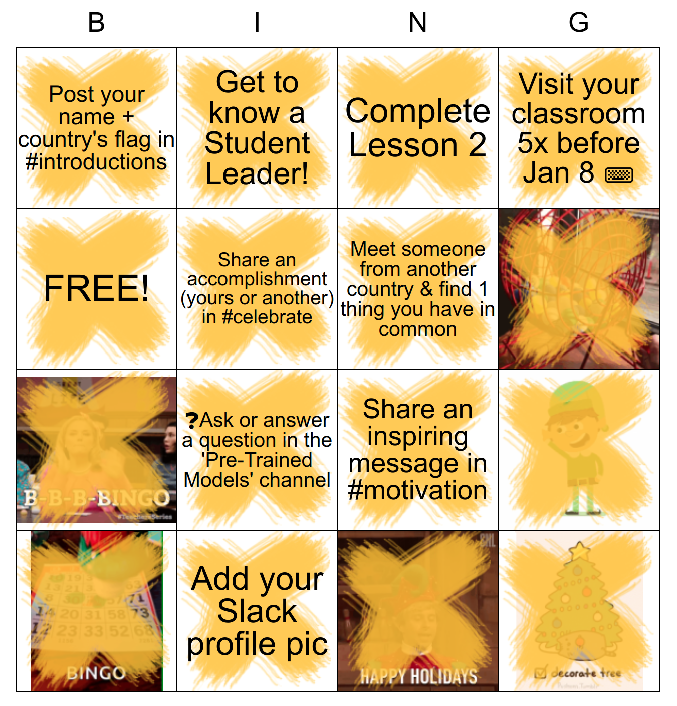
- Post your name + country's flag in #introductions.\
  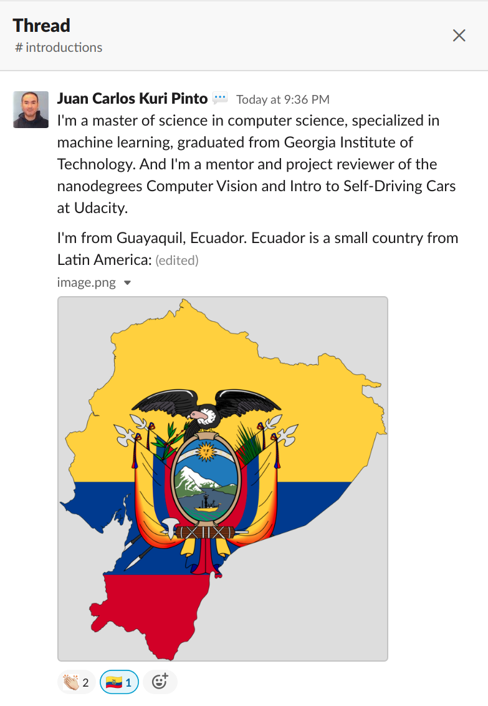
  https://inteledgeaichallenge.slack.com/archives/CR51QH6KC/p1578278178178600
- Get to know a Student Leader!\
  I contacted @Aishwarya Nevrekar, @Vishal Gupta, @Arnie Elkins, @JDL, @Kyu Lee, @Soumia, and @TEJAS R. PHASE.
- Complete Lesson 2.\
  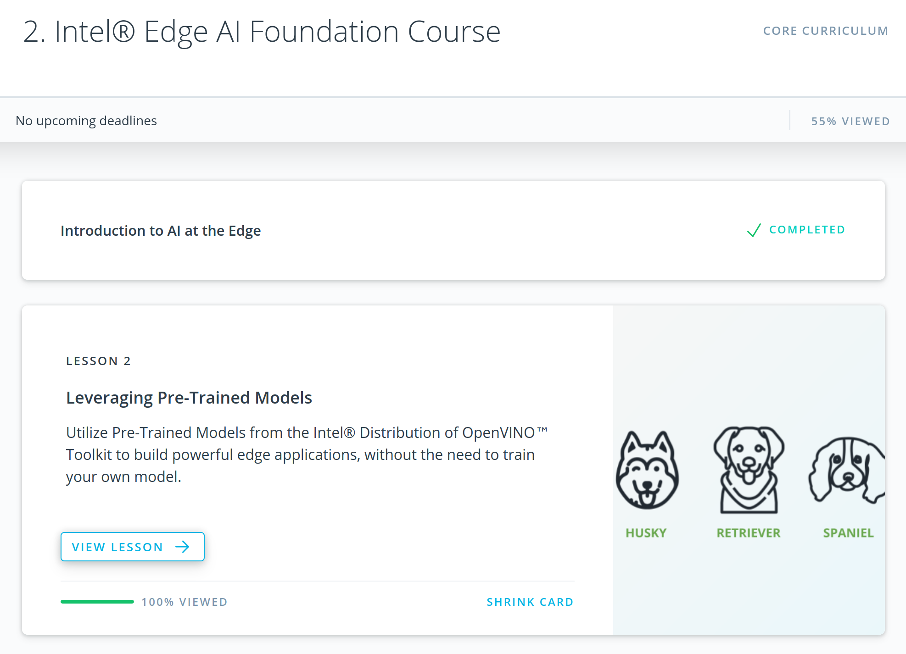
- Visit your classroom 5x before January 8.\
  Done. I've visited the Intel Edge AI Scholarship at both Udacity and Slack, much more than 5 times.
- Share an accomplishment (yours or another) in #celebrate.\
  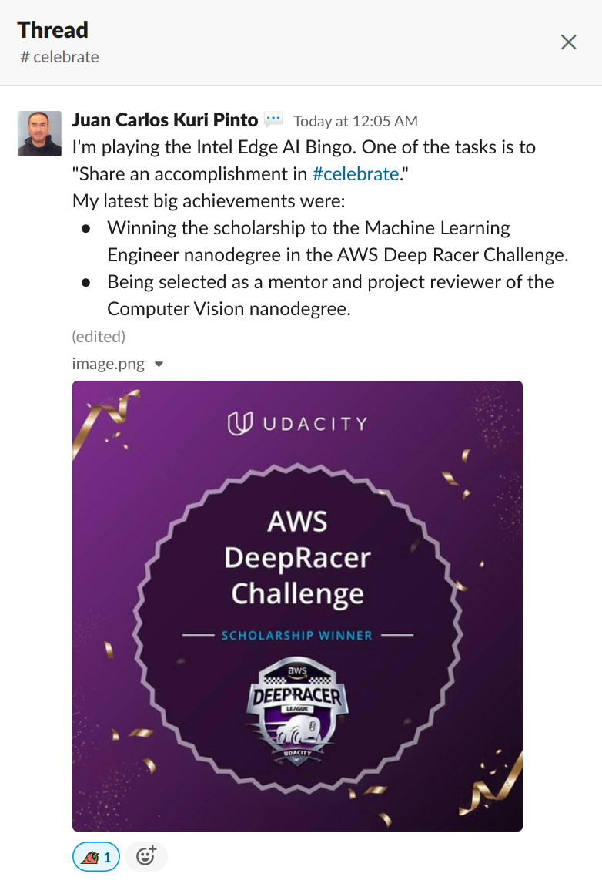
  https://inteledgeaichallenge.slack.com/archives/CRHAP13JQ/p1578287127441600
- Meet someone from another country & find 1 thing you have in common.\
  Nancy Al Aswad is from the Middle East and we both love artificial intelligence.\
  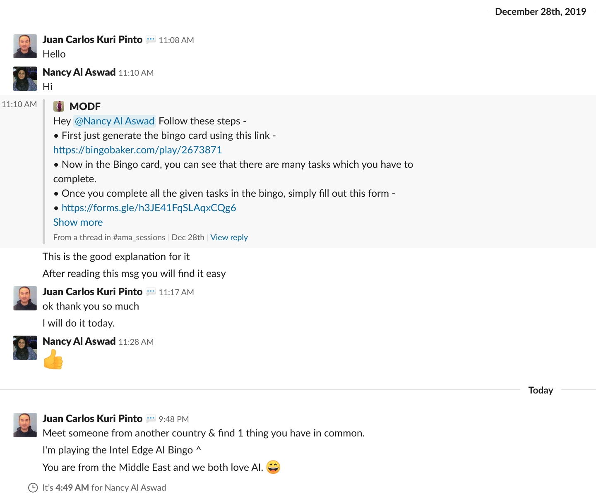
- Ask or answer a question in the "Pre-Trained Models" channel.\
  
  https://inteledgeaichallenge.slack.com/archives/CRQ5QJCAZ/p1578286391328100
- Share an inspiring message in #motivation.\
  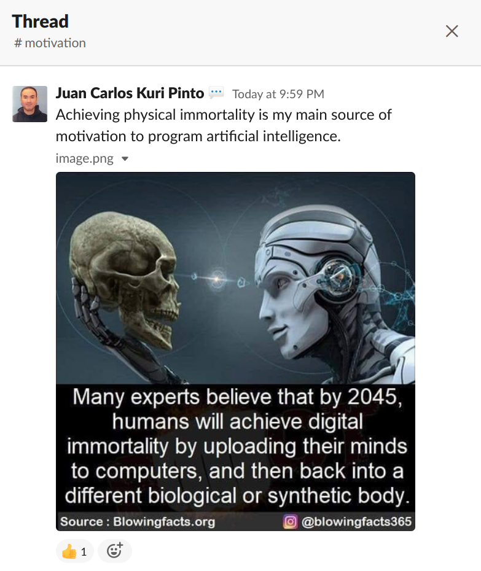
  https://inteledgeaichallenge.slack.com/archives/CR6AEAWGK/p1578279578404800
- Add your Slack profile pic.\
  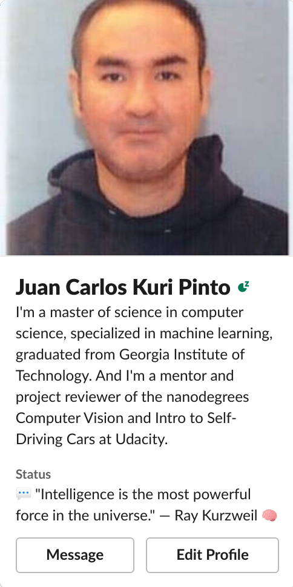
- Happy Holidays.\
  https://inteledgeaichallenge.slack.com/archives/CRHNR1139/p1578280630230700
  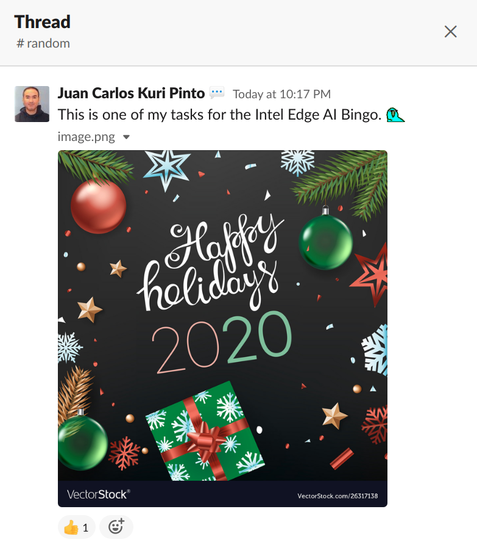

## Day 22: January 6, 2020. #30DaysofUdacity #FinalDaysof2019
- I watched some video lectures.
- My current progress is:\
  **Part 2. Intel® Edge AI Foundation Course** (Progress 56%)\
  **Lesson 3 - The Model Optimizer** (Progress 95%)\
  **19. Recap**
- I navigated through the Slack workspace of the Intel Edge AI Challenge.
- I encourage @KhushkumarP, @Jacqueline SusanM, @labibaR, @OudarjyaS, @MuhammadN, @Mohamed ChoukriB, @KonstantinosK, @AdityaK, @MahmmoudM, @LauraT, @ElenaK, @HelenaB, @RobO, @ShafaqA, @Nancy A, @TzuhsinC, @TemitopeO, @AarthiA, @NabhanA, @MD BAPPIP, @AnkitV, @fuzhanR, @Laszlo TothL. 

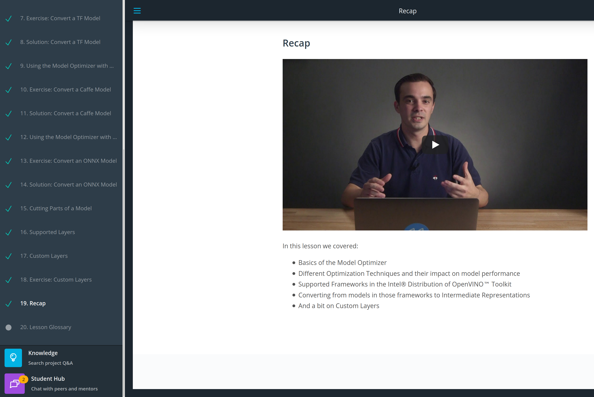

## Day 23: January 7, 2020. #30DaysofUdacity #FinalDaysof2019
- I watched some video lectures.
- My current progress is:\
  **Part 2. Intel® Edge AI Foundation Course** (Progress 57%)\
  **Lesson 3 - The Model Optimizer** (Progress 100%)\
  **20. Lesson Glossary**
- I navigated through the Slack workspace of the Intel Edge AI Challenge.
- I encourage @KhushkumarP, @Jacqueline SusanM, @labibaR, @OudarjyaS, @MuhammadN, @Mohamed ChoukriB, @KonstantinosK, @AdityaK, @MahmmoudM, @LauraT, @ElenaK, @HelenaB, @RobO, @ShafaqA, @Nancy A, @TzuhsinC, @TemitopeO, @AarthiA, @NabhanA, @MD BAPPIP, @AnkitV, @fuzhanR, @Laszlo TothL. 

## Day 24: January 8, 2020. #30DaysofUdacity #FinalDaysof2019
- I watched some video lectures.
- My current progress is:\
  **Part 2. Intel® Edge AI Foundation Course** (Progress 59%)\
  **Lesson 4 - The Inference Engine** (Progress 6%)\
  **1. Introduction**
- I navigated through the Slack workspace of the Intel Edge AI Challenge.
- I encourage @KhushkumarP, @Jacqueline SusanM, @labibaR, @OudarjyaS, @MuhammadN, @Mohamed ChoukriB, @KonstantinosK, @AdityaK, @MahmmoudM, @LauraT, @ElenaK, @HelenaB, @RobO, @ShafaqA, @Nancy A, @TzuhsinC, @TemitopeO, @AarthiA, @NabhanA, @MD BAPPIP, @AnkitV, @fuzhanR, @Laszlo TothL. 

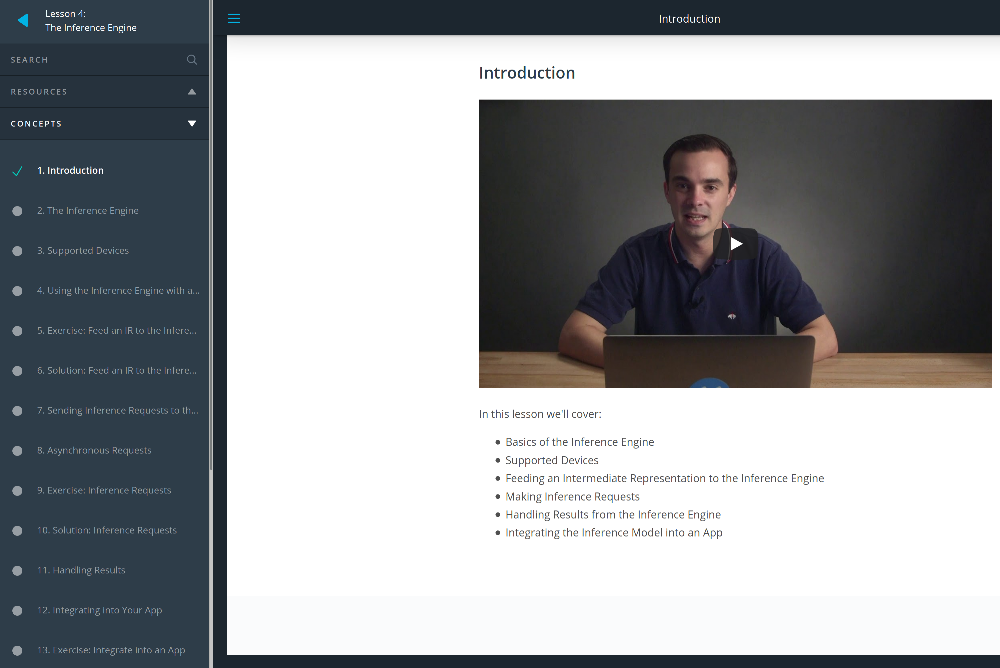

## Day 25: January 9, 2020. #30DaysofUdacity #FinalDaysof2019
- I watched some video lectures.
- My current progress is:\
  **Part 2. Intel® Edge AI Foundation Course** (Progress 60%)\
  **Lesson 4 - The Inference Engine** (Progress 12%)\
  **2. The Inference Engine**
- I navigated through the Slack workspace of the Intel Edge AI Challenge.
- I encourage @KhushkumarP, @Jacqueline SusanM, @labibaR, @OudarjyaS, @MuhammadN, @Mohamed ChoukriB, @KonstantinosK, @AdityaK, @MahmmoudM, @LauraT, @ElenaK, @HelenaB, @RobO, @ShafaqA, @Nancy A, @TzuhsinC, @TemitopeO, @AarthiA, @NabhanA, @MD BAPPIP, @AnkitV, @fuzhanR, @Laszlo TothL. 

## Day 26: January 10, 2020. #30DaysofUdacity #FinalDaysof2019
- I watched some video lectures.
- My current progress is:\
  **Part 2. Intel® Edge AI Foundation Course** (Progress 61%)\
  **Lesson 4 - The Inference Engine** (Progress 18%)\
  **3. Supported Devices**
- I navigated through the Slack workspace of the Intel Edge AI Challenge.
- I encourage @KhushkumarP, @Jacqueline SusanM, @labibaR, @OudarjyaS, @MuhammadN, @Mohamed ChoukriB, @KonstantinosK, @AdityaK, @MahmmoudM, @LauraT, @ElenaK, @HelenaB, @RobO, @ShafaqA, @Nancy A, @TzuhsinC, @TemitopeO, @AarthiA, @NabhanA, @MD BAPPIP, @AnkitV, @fuzhanR, @Laszlo TothL. 

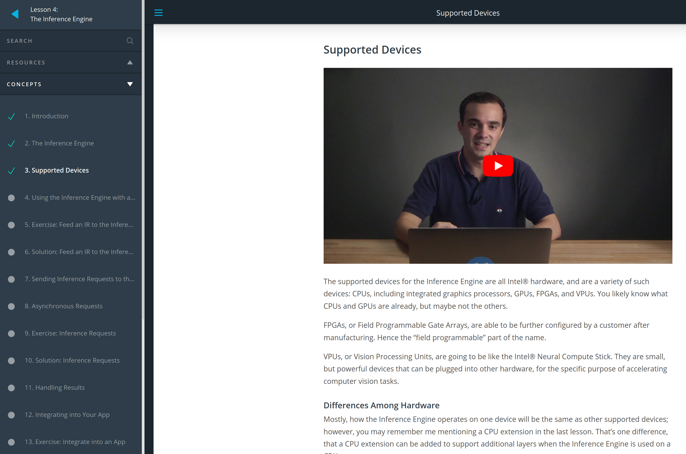
